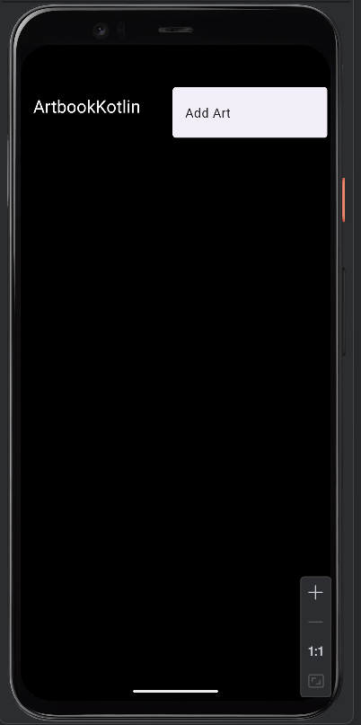
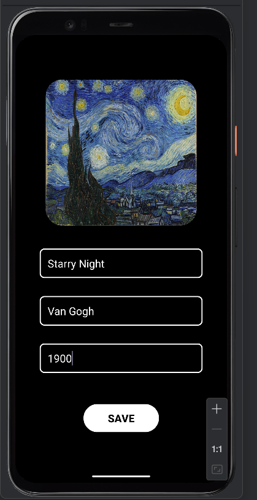
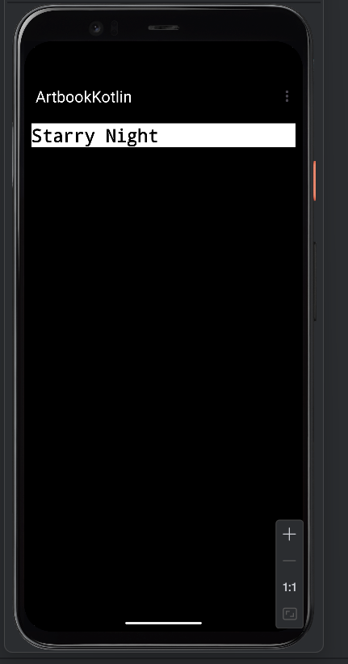

ArtBook Kotlin
A simple art record application built with Kotlin. Users can select an image, enter the name of the artwork, artist name, and year to create a record. Records are stored using SQLite.

Features
Select images from the gallery
Handle required permissions (using registerForActivityResult for Android 10+)
Store data with SQLite database
Add and save new artworks
User-friendly interface

Technologies Used
Kotlin
SQLite (local database)
View Binding
ConstraintLayout
LinearLayout
Runtime Permissions
Activity Result API (ActivityResultLauncher)
Custom XML Drawable (for borders, rounded corners, etc.)

Structure
MainActivity: Displays saved artworks
MainActivity2: Screen for adding new artwork
Art: Data class representing an artwork (optional)
art_menu.xml: Menu definition (Add Art button)
button_border.xml, edittext_rounded.xml: Custom shapes for UI

Permissions
The app uses READ_EXTERNAL_STORAGE to access images from the device gallery (for Android 13 and below). For newer versions, it uses READ_MEDIA_IMAGES.

Screenshots

